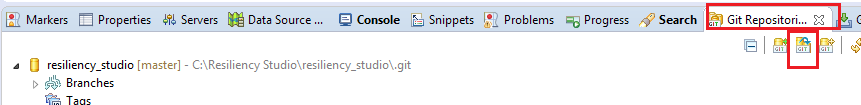
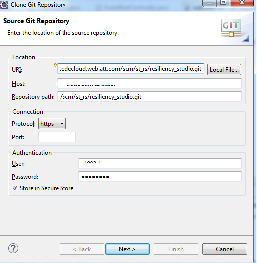
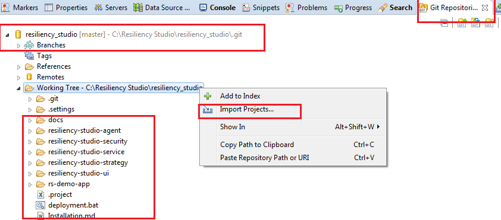
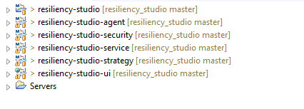
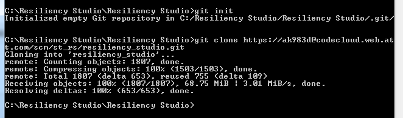
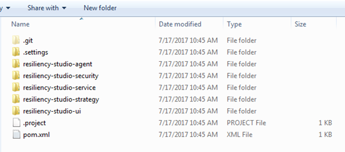
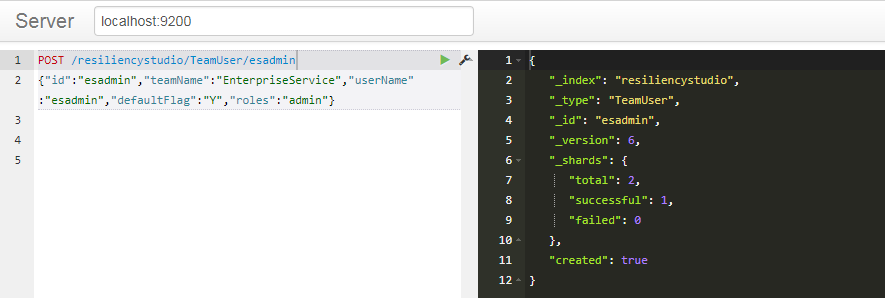
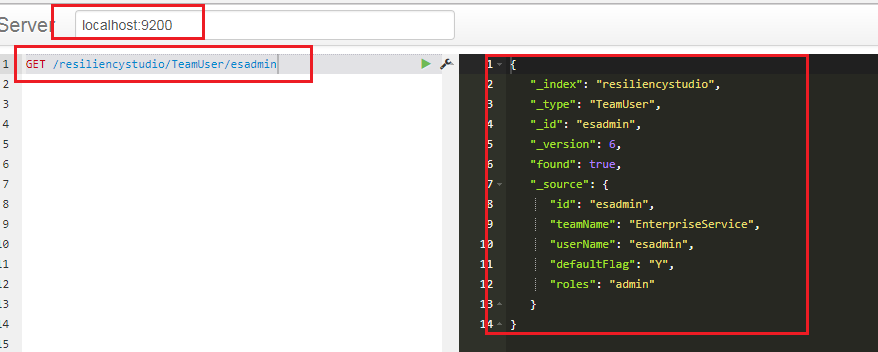

## Application Setup and Installation ##

### Hardware requirements ###

	OS - Windows/Linux
	
	RAM - Minimum of 4 GB
	
	Processor - Intel/AMD

### Software requirements ###

	Java 1.7 or later
	
	Apache Maven 3.3.9
	
	Git hub
	
	Tomcat 7.x or later
	
	Elastic search 2.3.12

### Software Installation ###
##### Java 1.8 

* Refer below link to download and setup JDK 1.8.x in your system.
* https://www3.ntu.edu.sg/home/ehchua/programming/howto/JDK_Howto.html

##### Maven
*	Install Maven v 3.3.9 and configure the settings respectively.
*	Please use attached maven settings.xml file and overwrite the settings.xml file available under  \apache-maven=3.3.9\conf folder
 
*	To verify open command prompt type mvn -version 

##### Tomcat
* Download Apache Tomcat 7.x or greater
* Follow instruction to install tomcat on your desktop

##### Elastic Search DB Setup
*	Download 2.3.1 version of Elastic Searchh
*	Next step is to configure 'Cluster Name'. Pls give a proper specific name which will be used throughout application 
*	Open 'elasticsearch.yml' property file available under '\elasticsearch-2.3.1\config\' folder
*	Update the 'cluster.name' property with value as 'attsa21'
*	To start elastic search use the batch file elasticsearch.bat

##### GIT
* Download the windows specific version and install GIT.
* After installation, add below path to the system properties.
* C:\Program Files\Git\bin

### Resiliency Studio Application Installation ###

#### Clone Resiliency Studio Application from GIT Repository 

URL: https://codecloud.web.att.com/scm/st_rs/resiliency_studio.git 

	resiliency-studio-ui   [UI]
	resiliency-studio-service  [Service]
	resiliency-studio-agent  [Execution Controller]
	resiliency-studio-security [Security]
	resiliency-studio-strategy [Monkey Strategies]  [Note: This module contains only Monkey Scripts]

#### Clone a repository Via Eclipse

* Open 'GIT Repositories' view and select 'Clone' option

* In a next dialog box, enter following information
	* GIT URL
	* GIT Credential information 

* Click on next - select 'master' branch and then click on 'Finish'. This will clone the repository in your user directory under '.git' folder.
* After cloning a repository, a tree structure for RS application will be seen in the 'GIT Repositories' view where you can import this as an Eclipse Maven project

* Click on 'Import Projects'. In the new dialog box, select an option of 'Import existing Eclipse project'. In the next dialog box, select all check box and click on finish.  This step will create a local workspace for Resiliency studio application as shown in below screenshot

**Note**:   Please make sure of following things:
 
* JDK 1.8 should be configured in the Eclipse under installable JRE's and should be selected as default JRE.
* Java compiler has to be set to 1.8 to compile the project successfully.

#### Clone a repository via command prompt -Windows 

Steps:

* Open a command console using 'cmd' in start window 
* Go to a directory where you want to clone this repository [for e.g.   cd <dir_name>]
* git init 
* git clone <git_url>
This will clone a repository under given directory

### Configure Resiliency Studio Application ###

Please follow below steps to setup RS Application configuration. 

**Note:**  *DON'T use of 'localhost' in the Service URL. Instead of using 'localhost', use full computer name. Full computer name can be found in the 'Computer' properties*

#### RS Secure Project (resiliency-studio-security)

Look out for *application.properties* file available under *src/main/resources/* folder, server port and context root is configured as '8083' and */resiliency-studio-security* respectively.  

**Note:** If there is a need to change in the port or context root then change in the application.properties file and refer it in the UI project accordingly.

	Service URL:  http://<server_name>:8083/resiliency-studio-security/

Here server_name will be either actual server name where application is deployed or if it is deployed in local machine then it will be 'Full Computer Name'. 

#### RS Agent (resiliency-studio-agent)

Look out for *application.properties* file under *src/main/resources/* folder, server port and context root is configured as '8084' and */resiliency-studio-agent* respectively.  

**Note:** If there is a need to change in the port or context root then change in the application.properties file and refer it in the UI project accordingly.

	Service URL:  http://<server_name>:8084/resiliency-studio-agent/

Here server_name will be either actual server name where application is deployed or if it is deployed in local machine then it will be 'Full Computer Name'.

#### RS Service  (resiliency-studio-service)

Look out for *application.properties* file available under */src/main/resources/* folder, server port and context root is configured as '8085' and */resiliency-studio-service* respectively.  

**Note:** If there is a need to change in the port or context root then change in the application.properties file and refer it in the UI project accordingly.

	Service URL:  http://<server_name>:8085/resiliency-studio-service/

Here server_name will be either actual server name where application is deployed or if it is deployed in local machine then it will be 'Full Computer Name'.

In the *resiliencystudio-dev.properties* file available under *src/main/resources/* folder,
 
i.	Update 'resiliencystudio.recorder.elasticsearch.cluster' property with a 'attsa21'  [it is same as we have configured in Elastic Search configuration file 'elasticsearch.yml']

ii.	Update 'resiliencystudio.agentURL' property with a proper RS Agent URL which is configured in Step 2.5.b.

#### RS UI Layer (resiliency-studio-ui):

In the 'appEnvironment.js' file present under 'src/main/webapp/app/services/' folder 

i.	'host' property is *servername:port*.   

Here server_name will be either actual server name where application is deployed or if it is deployed in local machine then it will be 'Full Computer Name'. Port will be Tomcat instance running port where RS UI application is deployed. 

For e.g.    host: 'abc0085.abc.com:8080'

Here abc0085.abc.com is my local machine computer name.8080 is the Tomcat port# where UI application is deployed.

ii.	'env_url' property will be – RS Service application URL

iii. 'sec_url' property will be – RS Secure application URL 

iv.	'agent_url' property will be – RS Agent application URL

UI Application URL will be  (considering Tomcat instance is running on 8080)–
	
	http://<server_name>:8080/resiliency-studio-ui/#/

### Build & Deploy ###

#### Start Elastic Search DB:
1.	Go to \elasticsearch-2.3.1\bin folder
2.	Run 'elasticsearch.bat' file to start Elastic Search instance which will run on port # 9200 by default 

#### Deployment via Command Console:   

Follow below steps to generate a deployable package and deployed in to the deployment container. 

A.	Open command console.

B.	Cd <root_project_dir>     [Go to the Root Project Directory which is resiliency-studio].

C.	mvn clean install    [This step will generate a following packages in their respective folder.]

		Note: Please check and enable your proxies to download all the required jar files
		You can use this settings.xml 		
		<settings>
		  <activeProfiles>
		    <!--make the profile active all the time -->
		    <activeProfile>securecentral</activeProfile>
		  </activeProfiles>
		  <profiles>
		    <profile>
		      <id>securecentral</id>
		      <!--Override the repository (and pluginRepository) "central" from the
		         Maven Super POM -->
		      <repositories>
		        <repository>
		          <id>central</id>
		          <url>https://repo1.maven.org/maven2</url>
		          <releases>
		            <enabled>true</enabled>
		          </releases>
		        </repository>
		      </repositories>
		      <pluginRepositories>
		        <pluginRepository>
		          <id>central</id>
		          <url>https://repo1.maven.org/maven2</url>
		          <releases>
		            <enabled>true</enabled>
		          </releases>
		        </pluginRepository>
		      </pluginRepositories>
		    </profile>
		  </profiles>
		</settings>

* resiliency-studio-agent-0.0.1-SNAPSHOT.jar    [This Jar will be generated under resiliency-studio/resiliency-studio-agent/target/ folder.]
* resiliency-studio-security-0.0.1-SNAPSHOT.jar    [This Jar will be generated under resiliency-studio/resiliency-studio-security/target/ folder.]
* resiliency-studio-service-0.0.1-SNAPSHOT.jar    [This Jar will be generated under resiliency-studio/resiliency-studio-service/target/ folder.]
* resiliency-studio-ui.war    [This WAR file will be generated under resiliency-studio/resiliency-studio-ui/target/ folder.]

D.	Deploy RS Secure Project (resiliency-studio-security):

* Make sure your current directory is root project directory i.e. resiliency-studio
* cd  <resiliency-studio-security/target>
* java -jar resiliency-studio-security-0.0.1-SNAPSHOT.jar    [This step will deploy resiliency-studio-security package to embedded Tomcat server running on port 8083

E.	Deploy RS Agent Project (resiliency-studio-agent):

* Make sure your current directory is root project directory i.e. resiliency-studio
* cd  resiliency-studio-agent/target    
* java -jar resiliency-studio-agent-0.0.1-SNAPSHOT.jar     [This step will deploy resiliency-studio-security package to embedded Tomcat server running on port 8084

F.	Deploy RS Service Project (resiliency-studio-service):

* Make sure your current directory is root project directory i.e. resiliency-studio
* cd  resiliency-studio-service/target   
* java -jar resiliency-studio-service-0.0.1-SNAPSHOT.jar     [This step will deploy resiliency-studio-service package to embedded Tomcat server running on port 8085

G.	Deploy RS-UI Project on Tomcat (resiliency-studio-ui):

* Copy generated war file into tomcat webapp directory   [for e.g.  \Tomcat 7\ webapps\resiliency-studio-ui.war]
* Run tomcat server via executing batch file (startup.bat). This batch file is available under Tomcat\bin folder. 
* This step will deploy resiliency-studio-ui package to Tomcat server running on port 8080.  [Pls check the Http port# in the server.xml file present under Tomcat/conf folder]

#### Deployment via Eclipse

A.	Clean and Build all the modules using Eclipse options  [Project -> Clean option in the menu bar]

B.	Deploy RS Secure Project (resiliency-studio-security):

* In Eclipse IDE, open an 'Application.java' class present under 'com.att.tta.rs' package in the resiliency-studio-security project
* Run this class as a 'Java application'
* It will deploy resiliency-studio-security package to embedded Tomcat server running on port 8083.

C.	RS Agent Project (resiliency-studio-agent):

* In Eclipse IDE, open an 'Application.java' class present under 'com.att.tta.rs' package in the resiliency-studio-agent project
* Run this class as a 'Java application'
* It will deploy resiliency-studio-agent package to embedded Tomcat server running on port 8084.

D.	RS Service Project (resiliency-studio-service):

* In Eclipse IDE, open an 'Application.java' class present under 'com.att.tta.rs' package in the resiliency-studio-security project
* Run this class as a 'Java application'
* It will deploy resiliency-studio-service package to embedded Tomcat server running on port 8085.

E.	RS UI Project (resiliency-studio-ui):

* In Eclipse IDE, add a Tomcat 7 instance as a server
* Add resiliency-studio-ui application on the server
* Start Tomcat server which will deploy resiliency-studio-ui package to Tomcat server running on port 8080.   [Pls check the Http port# by opening a Server Configuration Overview window in Eclipse.  Double click on the server name simply.

### Setup users

1. There are preconfigured users entries available into AuthUser.json file. This file is available in resiliency-studio-security project under 'src/main/resources/AuthUser' folder. Same file is attached here for reference 
               
2. This json file is having some preconfigured User Objects with following structure: 

i.	User ID

ii.	Password

iii.	Privilege  [one or more]

* Team Name
* Role permission  (either one of them [admin/power/user]

3.In the JSON file, 

A.	There should be only one entry for a user Id 

B.	      Inside the privilege section of a user ID, there can be more than one entry for       team name & role but each entry should have a unique team name. 

C.	    Other user entries can be added in this json file.  But 'role' should be anyone of   possible roles [admin, power, user] 

•	User with 'Admin' role can take any View, Create, Update, Delete Action in RS UI Application

•	User with 'Power' role can take only View, Create & Update action in RS UI application.

•	User with 'User' role can take only View action in RS UI application.

4.	This file has preconfigured four user entries with name as esadmin, espower, esuser & billingpower.
5.	User entries [esadmin, espower, & esuser] are associated to 'Enterprise Service' team.  These users are having different role privilege for 'Enterprise Service' team. 

6.	resiliency-studio-security project is using this json file internally for authenticating and authorizing a user 

### User Configuration - Elastic search 

1.	Open 'sense' or 'RESTED' Chrome extension to make a user entry into Elastic search

2.	Server text box should have server name and port name where Elastic search is up and running.  
For e.g. if it is running on local machine then text box should have value as  'localhost:9200'.   [considering it is running on port # 9200] 

3.	In the left side text area enter below command
POST /resiliencystudio/TeamUser/<user_ID>
{"id":"<user_ID>","teamName":"<team_name>","userName":"<user_ID>","defaultFlag":"Y","roles":"<role>"}

Here replace <user_ID> with actual user ID present into AuthUser.json file.  <team_name> & <role> will be replaced with any one of the entry available in AuthUser.json file for that user. 

	For e.g.
	POST /resiliencystudio/TeamUser/esadmin
	{"id":"esadmin","teamName":"test","userName":"esadmin","defaultFlag":"Y","roles":"admin"}

Note:  Each User ID configured in AuthUser.json file has to be configured in Elastic Search Database as well if it will be used to login into RS UI application. 

Run this command - this will create a user entry into Elastic search. After running this command you should be able to see successful response in the right side pane (as shown in below screenshot.)
 

Additional Commands:

a.	To check a user entry Role in ES:
GET /resiliencystudio/TeamUser/<user_id>
      
 

b.	To delete a user entry in ES:
DELETE /resiliencystudio/TeamUser/<user_id>

c.	To delete entire resiliencystudio index:
DELETE /resiliencystudio/

#### Use Application 
All modules are deployed on respective container and ready to use.  Hit below URL to access RS UI application.

	http://<server-name>:8080/resiliency-studio-ui/#/dashboard  
