## Resiliency Studio UI Application Features ## 

Resiliency Studio UI application provides following capabilities which will allow a user to run Resilient Test Cases against any on-boarded application server 

**Login Screen** to support authentication and authorization capabilities

**Dashboard** (Home page) to provide an outline of complete RS application 

**On-board an application** - Add an application with Server Hardware/software information where Monkey Script will induce a failure

**Edit/View Application**

**Add Monkey Strategy** - Here user can upload/write a shell/Ansible based script which will induce a certain failure in the targeted server

**Edit/Clone/View Monkey Strategy**

**Create Scenario** 

* This capability allows user to manually create a different resilient test case scenarios for an application by choosing appropriate Server hardware/software information and corresponding Monkey strategy created in the 'Monkey Strategy' section
* Also, here user can choose an option of 'Auto discovery' which will recommend a list of scenarios based on matching between Application server software/hardware information and corresponding available Monkey Strategies conditioning default flag and generic flag of these Money Strategies are set to 'True'

**View/Edit Scenario**

**Execute Scenario** It allows a user to execute a predefined scenarios available under that application. User can see the real time execution events in the 'Execution Events' widget after running a selected scenario. 

**Scenario Run YTD** This screen displays the list of scenarios executed till date with the latest execution at top

**Execution Dashboard** - This has to be configured with user's own Kibana to provide the holistic view of execution events in form of charts, bars, tables, views etc

### Resiliency Studio UI Application Design Screenshots ###

#### Login Screen

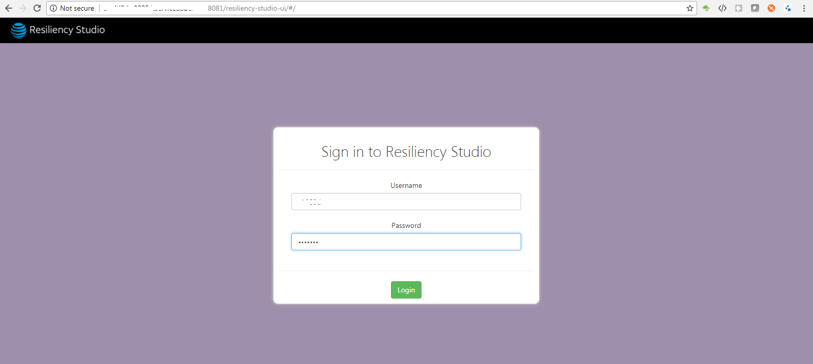

#### Dashboard Screen

Dashboard is home page of Resiliency Studio. The dashboard might vary due to different permission level for the user
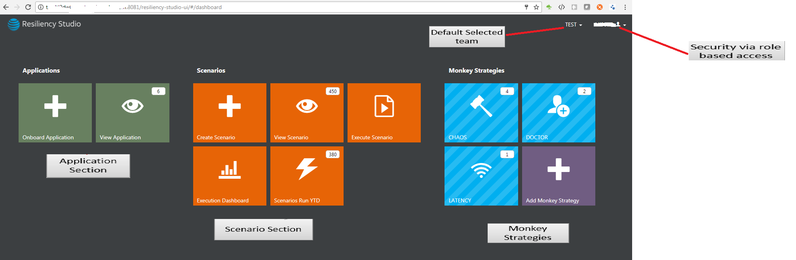

#### On-board an application

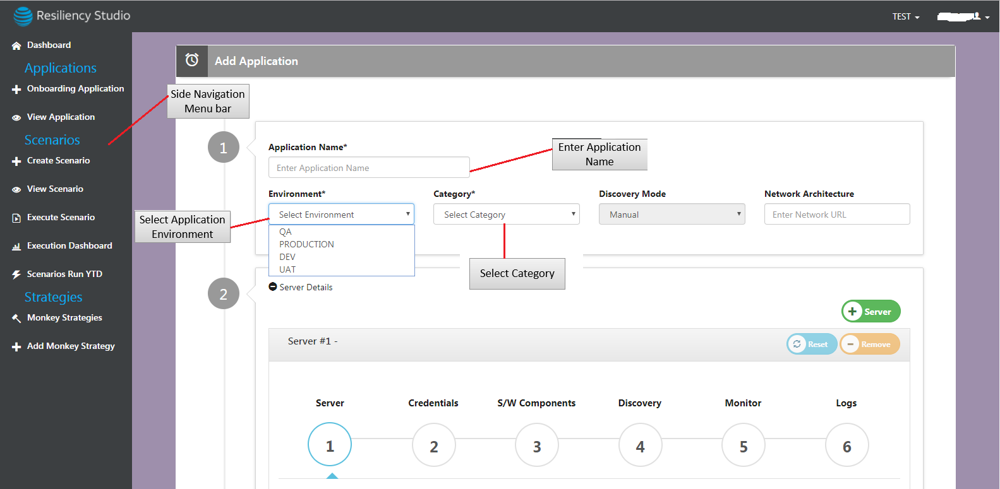

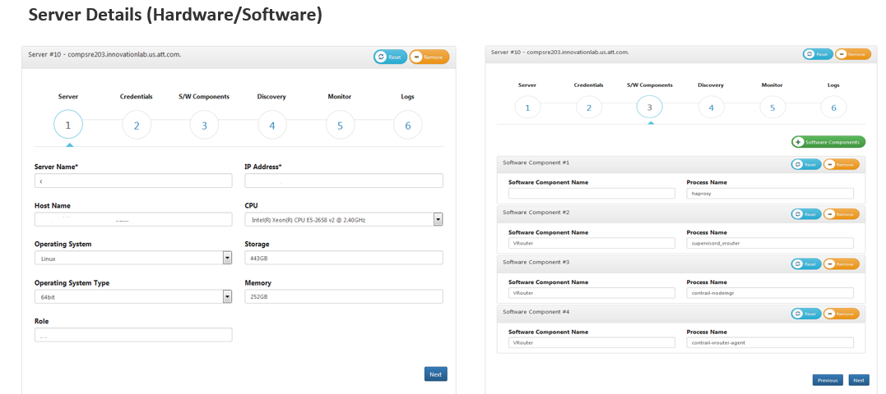

#### View Application

* View list of all applications. The user can expand application to view the application details
* The user can Edit the specific application by clicking edit and delete by clicking the delete icons. These icons will be available based on user privileges and roles under selected team

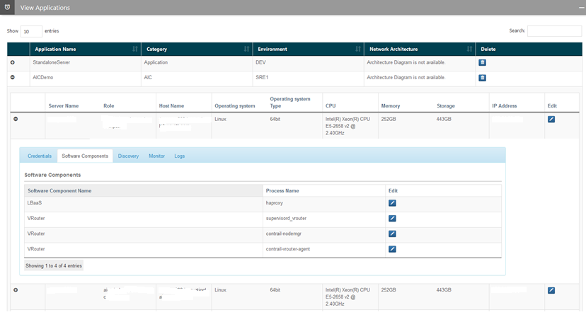

#### Edit Application

* User can edit an application by selecting an edit icon available in View Application screen 
* In the Edit application, user can see the Metric summary and Metrics Details section which will provide an upper sight of how many servers are available and under which role

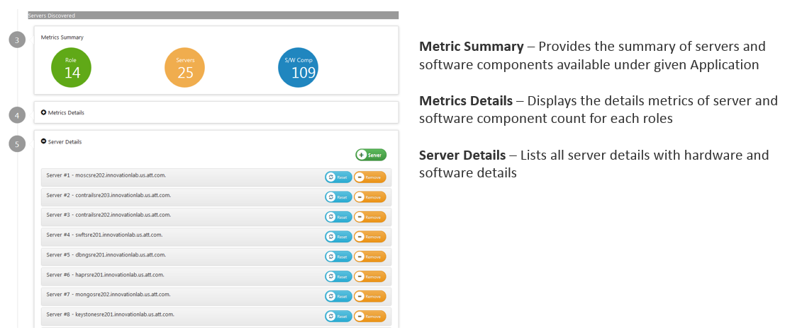

#### Add Monkey Strategy

* User can add a new monkey strategy by selecting an appropriate Monkey Type
* User can either upload a Monkey script file or write a script through popup box
* User can tag a monkey strategy to specific OS type, Flavor, Failure category, Failure Sub category and mark that one as a 'Generic' which can be used while doing 'Auto Discovery' of Scenarios 

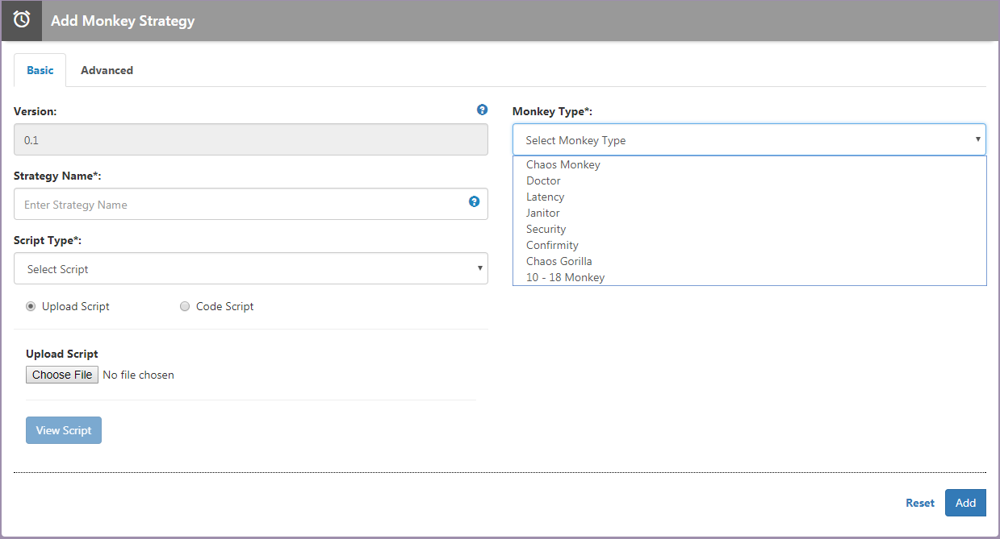
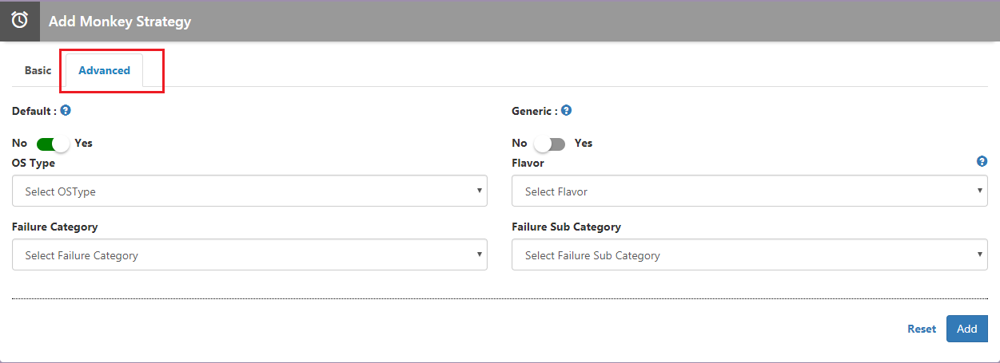

#### View Monkey Strategy

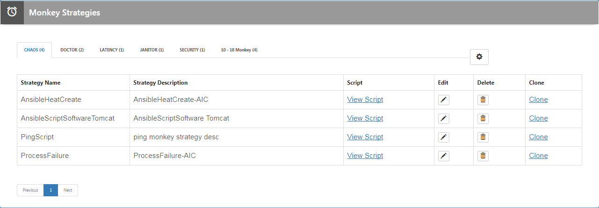

#### Create Scenario

* Onboard scenarios manually by providing the server name, failure tenant, failure mode, monkey type and monkey strategy.
* Multiple scenarios associated with single server or the single software component

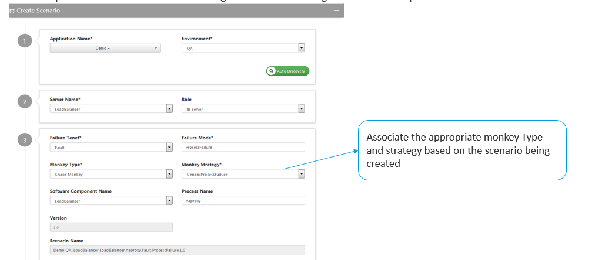

#### Create Scenario- Auto Discovery 

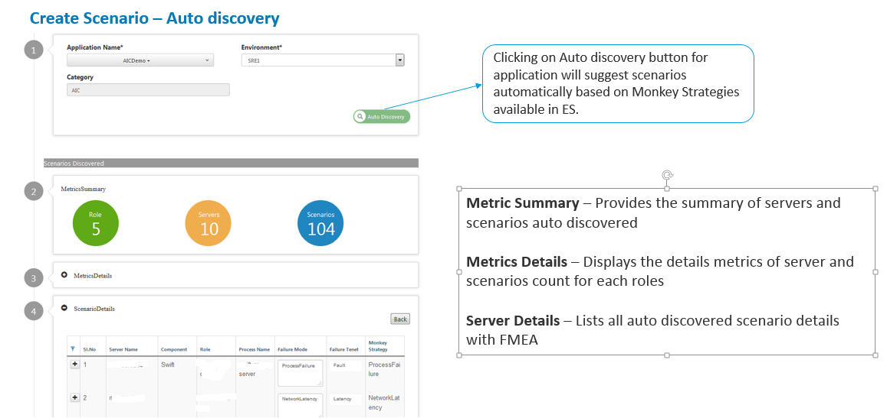

#### View Scenario

* Select application and environment to view the list of scenarios associated
* User can expand scenario row to view more details

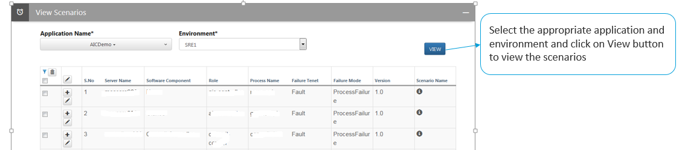

#### Execute Scenario

* Select application and environment to view the list of scenarios available for execution
* Check the desired scenario to execute and click on Run Now
* During the scenario execution the execution widgets will be loaded based on the configuration.
* Execution, monitoring, logging events can be viewed in respective widgets

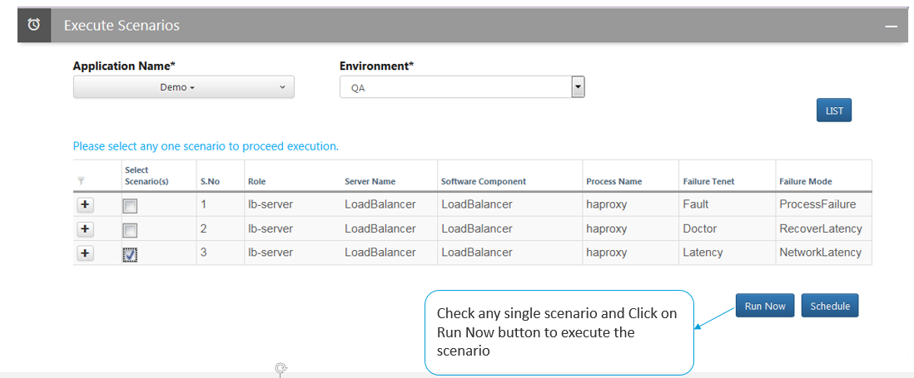
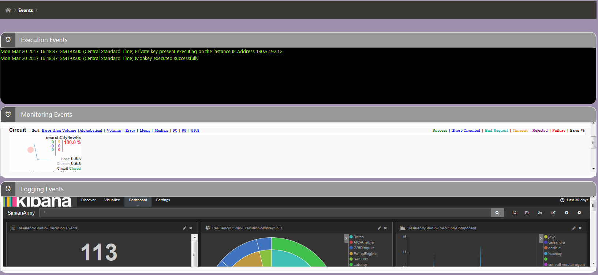

#### Scenario RUN YTD

View the scenarios executed till date with the latest execution at top

#### Execution Dashboard

* Select application to view the execution dashboard
* Different metrics and graph is represented in execution dashboard

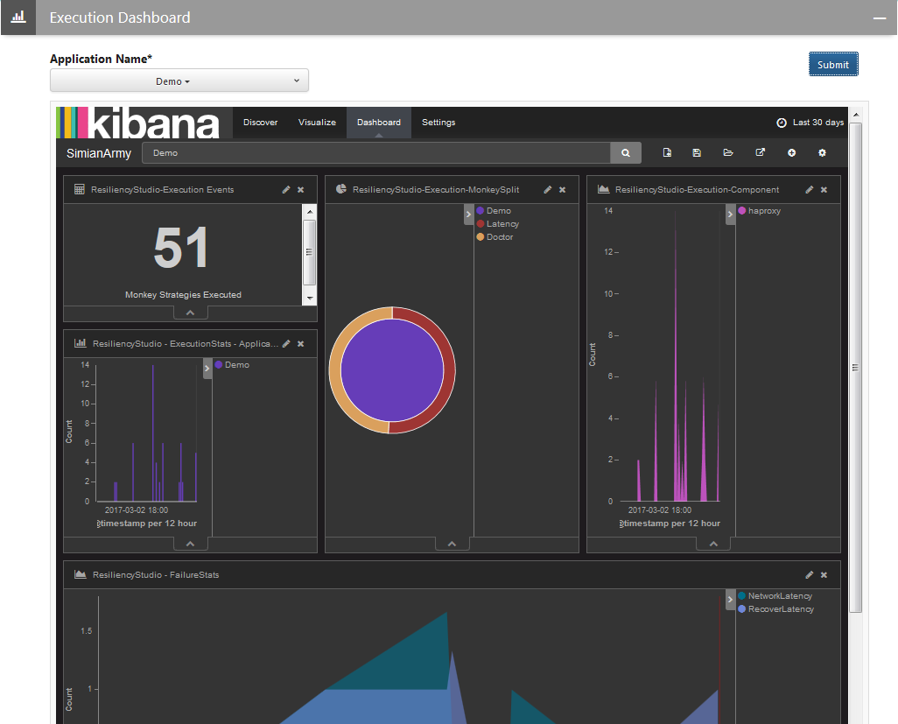

### Explanation about how Scenario Auto Discovery works ###

**Application Information**  Consider there is a one application having following Server hardware/software information:

|S.No.	|Server Name	|OS Type	|Component name	|Process Name	|
|1		|Server-1		|UNIX		|Jboss			|JBoss			|
|		|				|UNIX		|Tomcat	 		|Tomcat			|
|2		|Server-2		|UNIX		|Java			|Java			|

**Monkey Strategy Information**  Consider there are following Monkey Strategies available having Default Flag and Generic Flag set to 'True'

|S.No.	|Monkey Strategy Name	|OS Type	|Failure Category	|Failure Sub category	|
|1		|System_Failure			|UNIX		|Hardware			|All					|
|2		|Process_Failure		|UNIX		|Software			|All					|
|3		|Jboss_Failure			|UNIX		|Software			|Jboss					|
|4		|Java_Failure			|UNIX		|Software			|Java					|

**Scenario Auto Discovery** When auto discovery will be performed for this application then following scenarios will be recommended based on Application & Monkey strategy information.

|S.No	|Server Name	|OS Type	|Component name	|Process Name	|Monkey Strategy	|Failure Category	|Failure 	|Subcategory
|1		|Server-1		|UNIX	 	|System_Failure	|Hardware		|All		|		|
|2		|				|Jboss		|Jboss			|Process_Failure|Software	|All	|
|3		|				|Tomcat		|Tomcat			|Process_Failure|Software	|All	|
|4		|				|Jboss		|Jboss			|Jboss_Failure	|Software	|Jboss	|
|5		|Server-2		|UNIX	 	|System_Failure	|Hardware		|All		|		|
|6		|				|Java		|Java			|Process_Failure|Software	|All	|	
|7		|				|Java		|Java			|Java_Failure	|Software	|Java	|

